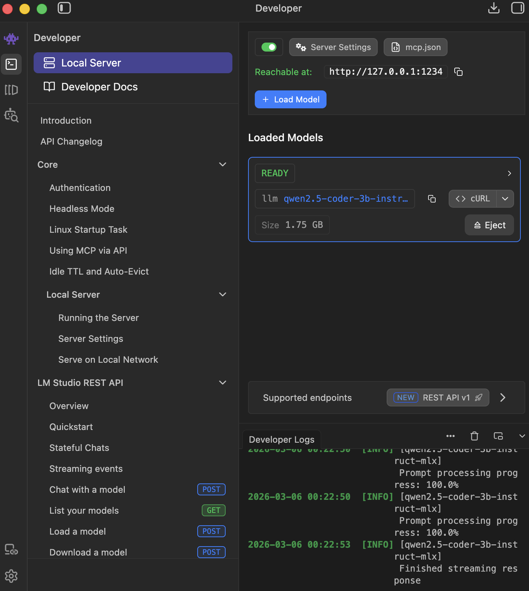
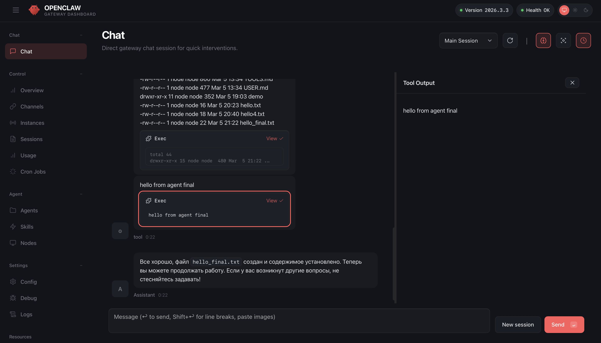
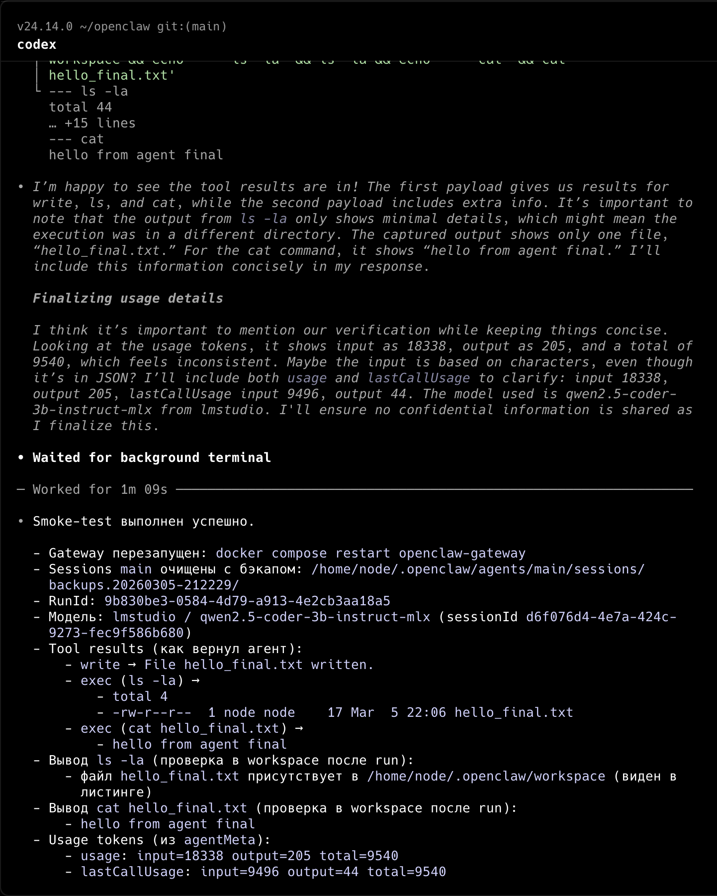

# Experiment: building a local AI agent that executes real system tools using a local LLM.

## Overview
This project explores how AI agents can execute real tasks using tools and local LLMs.

The experiment was built using a fully local stack running on macOS.

## Demo

### Local LLM Server

### AI Agent Executing Tools

### Smoke Test Result

## Stack
- LM Studio (local OpenAI-compatible inference)
- OpenClaw (AI agent gateway)
- Local LLM: Qwen2.5-Coder-3B-Instruct-MLX
- Docker

## Architecture
LM Studio runs the local model.

OpenClaw Gateway connects to the LLM via the OpenAI-compatible API and executes tools inside a workspace.

The agent can perform tasks such as:
- writing files
- executing shell commands
- returning tool results

## Experiment
A smoke test was executed where the AI agent:

1. Created a file
2. Executed system commands
3. Returned results from tool execution

Example task executed by the agent:
1. create file hello_final.txt
2. run ls -la
3. run cat hello_final.txt

## Result
The agent successfully executed tool calls and produced real system outputs.

This experiment demonstrates how autonomous agents can interact with real environments through structured tools.

## Purpose
This project explores the potential of AI agents for product experimentation and automation workflows.
